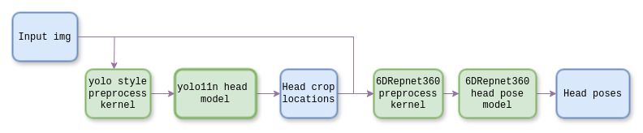

# 6DRepNet360_Tensorrt
This project is for head pose estimation. It uses a tensorrt-based implemntation of 6DRepNet360 in c++ environment.
<p align="center">
  
</p>

## Overview
The project runs in a two-stage manner. A head detector trained with yolo11 is used to extract heads crops, then the crops are further processed by 6DRepNet360, which would give a fine head pose result for each head crop in a 3x3 rotation matrix.  
<p align="center">
  
</p>


## Prepare models
Clone the repo.
```bash
git clone 
```
You need to make sure cuda and tenssort is properly installed under your Ubuntu os.  
```bash
dpkg -l | grep cuda
dpkg -l | grep tensorrt
```
The repo uploads a trained yolo11n head detection onnx file and a 6DRepNet360 head pose estimation onnx file under model folder. You could directly export them into .trt files using the following script:
```
bash tool/onnx2trt.sh
```
After seconds to minutes waiting, the two exported plan files and logs would be under the model folder too.
## Compile Codes
Before compliation, you need to check your gpu's compute capacity [here](https://developer.nvidia.com/cuda-gpus), and build the codes as following.
```bash
cd 6DRepNet360-Tensorrt && mkdir build && cd build
cmake ../ -DDEVICE_ARCH=/your/device/capacity && make -j
```
The repo would choose tensorrt's enqueue versions automatically to compile according to your tensorrt versions. If your trt version is newer than 10.0, enqueueV3() and auxiliary apis would be used, otherwise, enqueueV2() is used.  
## Usage
To run a 6DRepNet360 head pose estimation with a single image, run:
```bash
cd build && ./head_pose_est /path/to/input_image /path/to/output_image
```
To run a 6DRepNet360 head pose estimation with a video, run:
```bash
cd build && ./head_pose_est_video /path/to/input_video /path/to/output_video
```
## License
The repo is under MIT license.
## References
🔗 [6DRepNet360](https://github.com/thohemp/6DRepNet360/blob/master/README.MD)
🔗 [Yolo11](https://github.com/ultralytics/ultralytics.git)
🔗 [PINTO](https://github.com/PINTO0309/PINTO_model_zoo/tree/main/423_6DRepNet360)